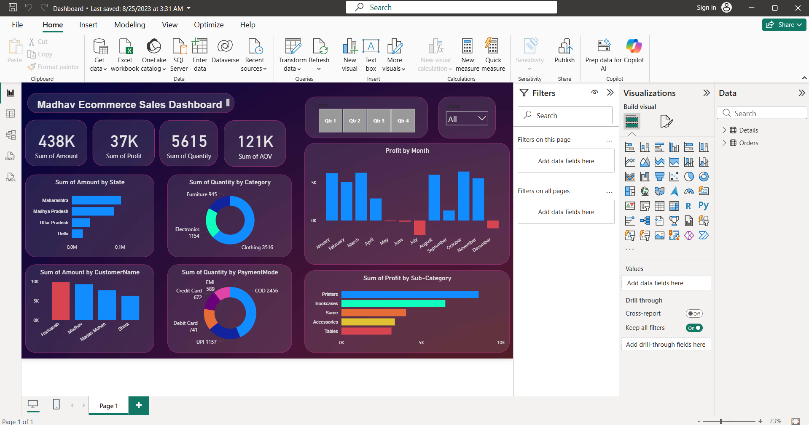

```markdown
# Madhav Ecommerce Sales Dashboard

A Power BI dashboard analyzing ecommerce sales performance, profit trends,
and customer behavior for Madhav Store across India.

---

## Dashboard Preview



---

## Project Overview

This dashboard provides a complete overview of Madhav Store's ecommerce
operations, tracking sales amounts, profit margins, order quantities, and
payment preferences across different states, categories, and customers.

---

## Key Metrics

| Metric | Value |
|---|---|
| Total Sales Amount | 438K |
| Total Profit | 37K |
| Total Quantity Sold | 5,615 |
| Sum of AOV | 121K |

---

## Key Insights

- **Top State:** Maharashtra leads in sales amount followed by Madhya Pradesh
- **Top Category:** Clothing dominates quantity sold with 3,516 units, followed by Electronics at 1,154
- **Payment Mode:** COD is the most preferred payment method with 2,456 transactions, followed by UPI at 1,157
- **Most Profitable Sub-Category:** Printers top the profit chart followed by Bookcases and Sarees
- **Profit Trend:** Profitable months are January through July, with losses recorded in August, October and December
- **Top Customer:** Harivansh generates the highest sales amount among all customers

---

## Files Included

| File | Description |
|---|---|
| `madhav_store.pbix` | Power BI dashboard file |
| `*.xlsx` | Raw ecommerce data source |

---

## Tools Used

- **Power BI Desktop** — Dashboard design & DAX measures
- **Microsoft Excel** — Data source

---

## Data Source

The dataset includes ecommerce transaction records covering sales amount,
profit, quantity, payment modes, customer names, product categories,
and state-wise distribution across all four quarters.
```
